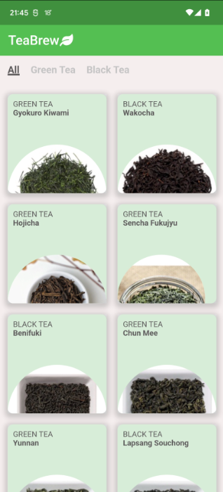

# Tea Catalog&Timer App With GraphCMS Synchronization

## Flutter Mobile App
Flutter mobile application is located in the [app](app) folder.

## GraphCMS Connector
Dart plugin for GraphCMS synchronization is located in [networking](networking) folder.

## Android Alarm Manager Plugin
[alarm_plugin](alarm_plugin) folder contains Flutter plugin to utilize Android Alarm Manager to show a toast notification.